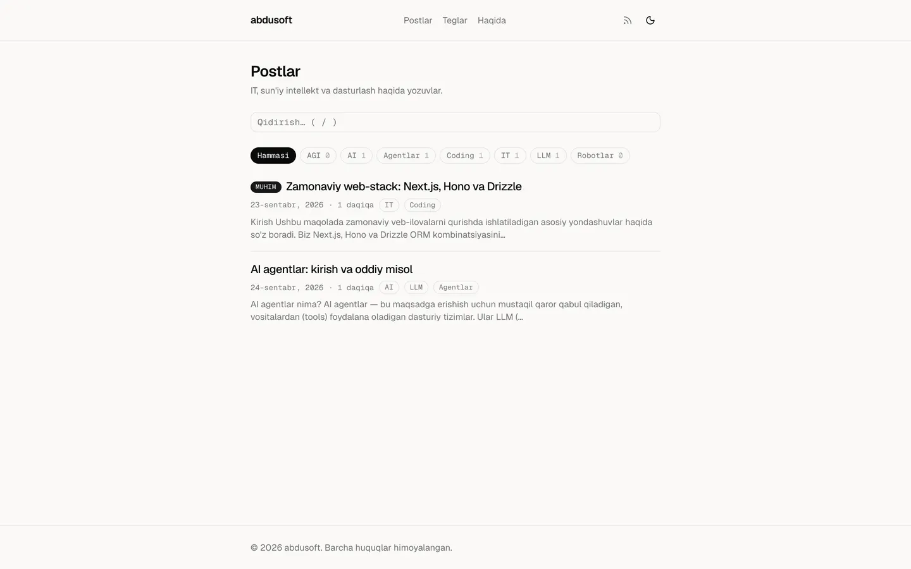
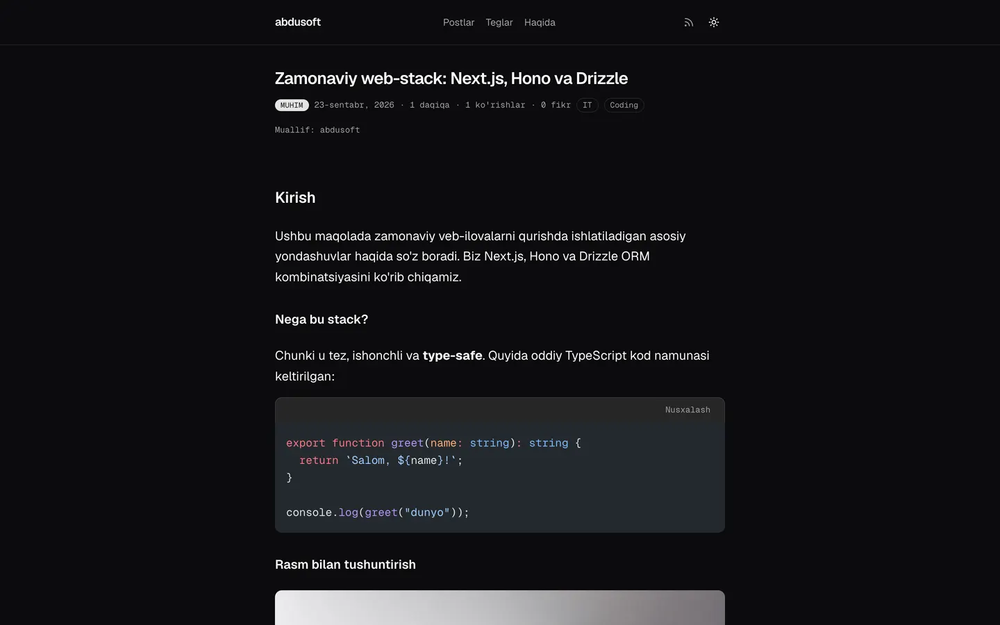
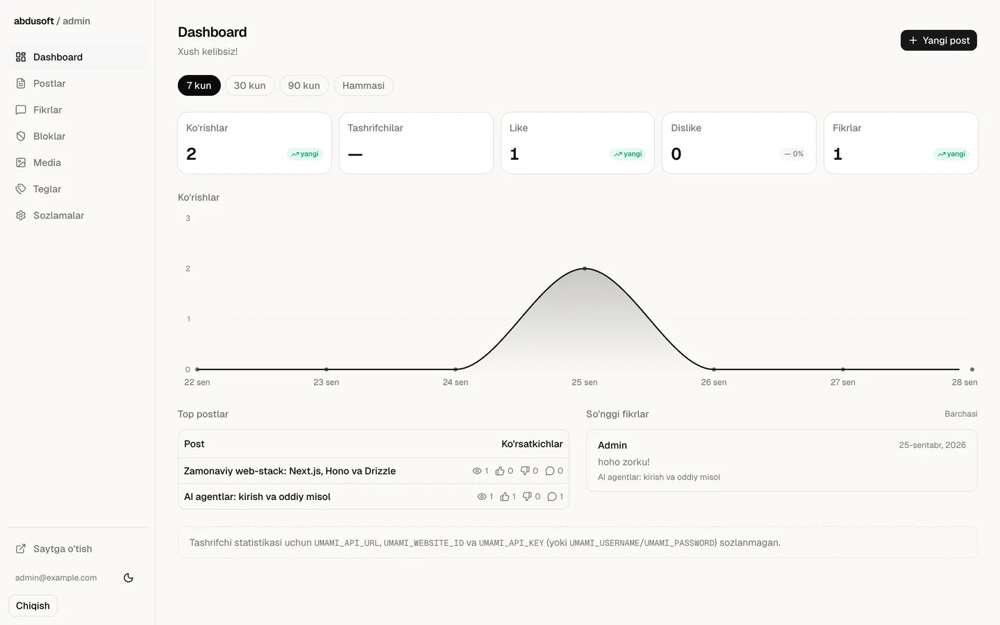
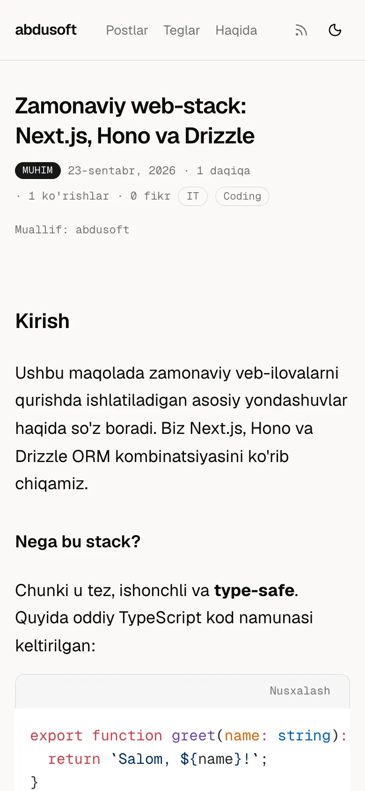
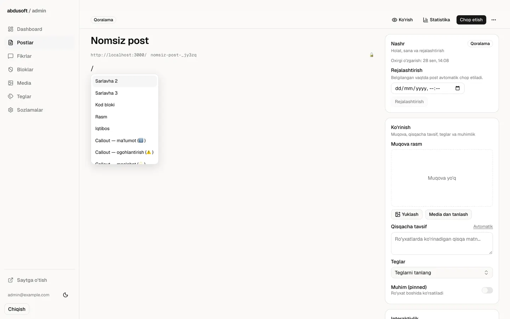
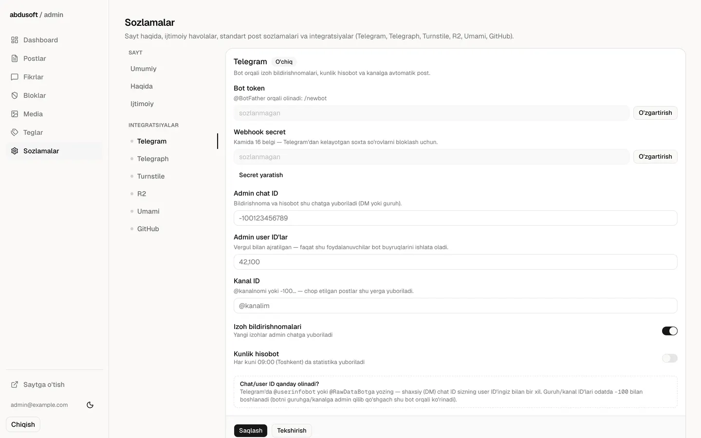
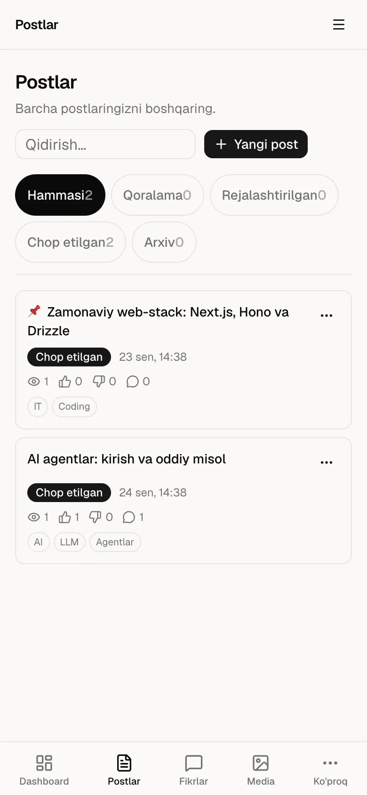

# abdusoft blog

🇺🇿 Shaxsiy texnologik blog platformasi — IT, sun'iy intellekt, AGI, LLM, agentlar va robototexnika mavzularida. Next.js + Hono + Postgres asosida, Telegram integratsiyasi bilan.

🇬🇧 Personal tech blog platform — for posts on IT, AI, AGI, LLMs, agents and robotics. Built on Next.js + Hono + Postgres, with deep Telegram integration.


[🇺🇿 O'zbekcha](#ozbekcha) · [🇬🇧 English](#english)

|  |  |  |
|---|---|---|
|  |  |  |

---

## O'zbekcha

### 1. Nima bu?

abdusoft blog — bitta muallif uchun mo'ljallangan, to'liq boshqariladigan texnologik blog platformasi. Ochiq qismida o'quvchi uchun tezkor, qidiriladigan va SEO-do'st postlar, teglar va RSS bor; yopiq `/admin` qismida esa Tiptap-asosidagi WYSIWYG muharrir, statistika dashboard'i va integratsiyalar boshqaruvi joylashgan. Chop etilgan postlar avtomatik ravishda Telegram kanaliga yuboriladi va Telegraph'da ko'zgulanadi, izohlar esa admin chatga bildirishnoma sifatida keladi va shu yerdan tasdiqlanadi. Loyiha ikkita mustaqil ilovadan iborat monorepo: `apps/web` (Vercel'da) va `apps/api` (o'z VDS'ida, Docker orqali).

### 2. Imkoniyatlar

**O'quvchi uchun**

- Server-render qilingan post sahifalari, avtomatik mundarija (TOC), o'qish vaqti hisobi
- Shiki bilan syntax-highlighted kod bloklari (light/dark ikkala tema uchun)
- To'liq matnli qidiruv (Postgres full-text + qisqa so'zlar uchun ILIKE fallback), teglar bo'yicha filtr
- RSS lenta (`/rss.xml`), `sitemap.xml`, `robots.txt`
- Har bir post uchun avtomatik OG rasm (`opengraph-image.tsx`)
- Tizim afzalligiga mos yoki qo'lda tanlanadigan dark/light rejim

**Fikrlar va reaksiyalar**

- Daraxt shaklidagi (threaded, 8 daraja chuqurlikkacha) izohlar, "yangi"/"top" saralash va cursor-based pagination
- Layk/dizlayk reaksiyalari, qurilma-asosidagi anonim identifikatsiya (cookie/token hash) — ro'yxatdan o'tish shart emas
- Anonim izoh yoki GitHub orqali kirib izoh qoldirish (ixtiyoriy, `NEXT_PUBLIC_GITHUB_LOGIN`)
- Moderatsiya: pending/hidden holatlar, admin panel yoki Telegram bot tugmalari orqali tasdiqlash/rad etish
- Spam himoyasi: Cloudflare Turnstile, IP+qurilma bo'yicha rate-limit, bloklangan qurilmalar ro'yxati (`bannedDevices`)

**Admin panel**

- Tiptap muharriri, `/` slash-menyu (sarlavha, kod bloki, rasm, iqtibos, callout'lar) orqali tezkor formatlash
- Avtosaqlash, rejalashtirilgan chop etish (sana/vaqt tanlab qo'yish), qoralama/rejalashtirilgan/chop etilgan/arxiv holatlar
- Media boshqaruvi — yuklash, mavjud fayllardan tanlash, R2 yoki mahalliy diskka saqlash
- Teglar boshqaruvi, har bir post uchun alohida sozlamalar (izohlar yoqiq/o'chiq, reaksiyalar, dizlayk ko'rsatish, TOC, Telegraph ko'zgu, kanalga avtomatik post, anonim izoh ruxsati, izoh moderatsiyasi)
- Statistika dashboard'i — ko'rishlar grafigi, top postlar, so'nggi izohlar, Umami tashrifchi statistikasi (sozlangan bo'lsa)
- Barcha integratsiyalar (`/admin/sozlamalar`) UI orqali boshqariladi — env o'zgaruvchisi ustunlik qiladi, DB'da saqlangan sirlar AES-256-GCM bilan shifrlanadi

**Telegram**

- Chop etilgan post avtomatik kanalga yuboriladi (rasm + qisqa matn + havola)
- Har bir post Telegraph'da ko'zgulanadi (uzun postlar uchun qulay o'qish)
- Admin chatga izoh bildirishnomalari — inline tugmalar bilan to'g'ridan to'g'ri tasdiqlash/rad etish/bloklash
- Bot buyruqlari: `/stats`, `/posts`, `/pending`, `/comments <slug> on|off`, `/publish` / `/unpublish`, `/digest`
- Kunlik hisobot (digest) — yoqilsa, belgilangan vaqtda statistikani admin chatga yuboradi

**Xavfsizlik**

- Sirlar (bot token, R2 kaliti, Turnstile secret va h.k.) bazada `BETTER_AUTH_SECRET`dan olingan kalit bilan AES-256-GCM shifrlangan holda saqlanadi
- Telegram webhook so'rovlari `X-Telegram-Bot-Api-Secret-Token` header orqali tekshiriladi (kamida 16 belgili secret — bo'lmasa bot yoqilmaydi)
- CORS faqat `WEB_ORIGIN`ga ruxsat beradi, `credentials: true`
- Qat'iy CSP/`secureHeaders()`; `/uploads/*` uchun alohida sandbox CSP (SVG'lar xavfsiz xizmat qilinishi uchun) — bundan tashqari yuklashda SVG `sanitize-html` bilan tozalanadi, markdown/HTML render XSS'dan sanitizatsiya qilinadi
- Cloudflare Turnstile (ixtiyoriy, prod'da fail-closed rejimga o'tkazilishi mumkin), izoh/reaksiya uchun IP+qurilma rate-limit, bloklangan qurilmalar ro'yxati
- `TRUST_PROXY` bayrog'i orqali mijoz IP'ini faqat ishonchli proksi orqasida `x-forwarded-for`dan olish (spoofing'dan himoya)
- Qidiruvda `ILIKE` maxsus belgilari (`%`, `_`, `\`) escape qilinadi
- Docker image'da non-root foydalanuvchi, `HEALTHCHECK`, fail-fast migratsiya (`entrypoint.sh`)

### 3. Skrinshotlar

| | |
|---|---|
|  <br> Bosh sahifa, light rejim |  <br> Post sahifasi, dark rejim, kod bloki |
|  <br> Post sahifasi, mobil |  <br> Admin — statistika dashboard'i |
|  <br> Admin — Tiptap muharrir, `/` slash-menyu |  <br> Admin — Telegram sozlamalari |
|  <br> Admin — postlar ro'yxati, mobil | |

### 4. Arxitektura

```
                    ┌─────────────────────┐
   Foydalanuvchi ──▶│  apps/web (Vercel)  │
                    │  Next.js App Router  │
                    └──────────┬──────────┘
                               │ HTTPS (fetch, credentials: include)
                               ▼
                    ┌─────────────────────┐        ┌────────────────┐
                    │  apps/api (VDS)      │◀──────▶│  PostgreSQL 17  │
                    │  Hono + Drizzle ORM   │        └────────────────┘
                    │  Better Auth          │
                    │  grammY (Telegram)    │───────▶ Telegram Bot API
                    │                       │───────▶ Telegraph API
                    │                       │───────▶ Cloudflare R2 (media)
                    └──────────┬────────────┘
                               │ proxy (UMAMI_API_URL)
                               ▼
                    ┌─────────────────────┐
                    │  Umami analytics     │
                    │  (o'z konteyneri)     │
                    └─────────────────────┘
```

`apps/web` ma'lumotlar bazasiga to'g'ridan-to'g'ri kirmaydi — faqat `apps/api` orqali HTTP so'rovlar bilan ishlaydi. VDS'da nginx (mavjud, boshqa saytlar bilan bir qatorda ishlab turgan) `apps/api` konteynerini `api.abdusoft.uz` orqali teskari proksi qiladi (batafsil — Deploy bo'limi).

**Monorepo tuzilishi**

| Papka | Nima |
|---|---|
| `apps/web` | Next.js 16 (App Router) — ochiq sayt + `/admin` paneli |
| `apps/api` | Hono + Drizzle + Postgres/PGlite — REST API, auth, Telegram bot, media |
| `packages/shared` | `@blog/shared` — zod DTO'lar, `slugify`, standart teglar/sozlamalar |
| `scripts/` | Prod env generatsiya (`init-prod-env.sh`), Vercel env push (`vercel-env-push.sh`) |
| `docs/` | Skrinshotlar va boshqa hujjat materiallari |

**Texnologiyalar**

| Qatlam | Texnologiya | Versiya |
|---|---|---|
| Frontend | Next.js (App Router, Turbopack) | 16.3.6 |
| | React | 19.2.8 |
| | Tailwind CSS | 4 |
| | Tiptap (WYSIWYG muharrir) | 3.31.3 |
| Backend | Hono | 4.13.9 |
| | Drizzle ORM | 0.45.3 |
| | Better Auth | 1.7.6 |
| | grammY (Telegram bot) | 1.46.0 |
| | Shiki (kod highlight) | 4.4.3 |
| | Sharp (rasm ishlov berish) | 0.35.4 |
| Ma'lumotlar bazasi | PostgreSQL (prod) / PGlite (dev) | 17 / 0.5.8 |
| Umumiy | TypeScript | 5.9.3 |
| | Zod | 4.6.5 |
| | Vitest | 5.0.2 |
| Paket menejeri | pnpm | 10.30.3 |

### 5. Tez boshlash

**Talablar**

- Node.js ≥ 24
- pnpm 10 (**faqat pnpm** — npm/yarn lockfile'ni buzadi)
- Docker yoki Postgres SHART EMAS — `DATABASE_URL` bo'sh qoldirilsa `apps/api` avtomatik PGlite (fayl-asosidagi Postgres) ishlatadi

**O'rnatish va ishga tushirish**

```bash
pnpm install

cp apps/api/.env.example apps/api/.env
cp apps/web/.env.example apps/web/.env.local
# apps/api/.env ichida BETTER_AUTH_SECRET'ni almashtiring:
#   openssl rand -hex 32

pnpm api:migrate     # sxema migratsiyasi (PGlite: apps/api/.data/pglite)
pnpm api:seed        # admin, standart teglar va 2 ta namunaviy post

pnpm dev             # @blog/shared build, so'ng api :4000 va web :3000 parallel
```

| Manzil | Nima |
|---|---|
| http://localhost:3000 | Ochiq sayt |
| http://localhost:3000/admin | Admin panel |
| http://localhost:4000 | API (`/health`) |
| `admin@example.com` / `admin12345` | Standart admin login (`.env`dagi `ADMIN_EMAIL`/`ADMIN_PASSWORD`) |

**Lokal bazani tozalash / qayta boshlash**

```bash
rm -rf apps/api/.data/pglite
pnpm api:migrate && pnpm api:seed
```

### 6. Skriptlar

Root `package.json`:

| Skript | Nima qiladi |
|---|---|
| `pnpm dev` | `@blog/shared`ni build qilib, api/web/shared'ni parallel (watch) ishga tushiradi |
| `pnpm build` | Barcha paketlarni bog'liqlik tartibida build qiladi (shared → api/web) |
| `pnpm lint` | ESLint — barcha paketlar |
| `pnpm typecheck` | `tsc --noEmit` — barcha paketlar |
| `pnpm test` | `@blog/shared`ni build qilib, barcha vitest testlarni ishga tushiradi |
| `pnpm api:migrate` | `apps/api` migratsiyalarini qo'llaydi |
| `pnpm api:seed` | `apps/api` seed skriptini ishga tushiradi |

`scripts/`:

| Skript | Nima qiladi |
|---|---|
| `scripts/init-prod-env.sh` | Prod `.env` fayllarini (api + web) interaktiv yoki `--yes` bilan generatsiya qiladi, sirlarni `openssl rand -hex` bilan yaratadi |
| `scripts/vercel-env-push.sh` | `apps/web/.env.production`dagi qiymatlarni Vercel loyihasiga yuboradi |

> **Muhim:** `@blog/shared` runtime uchun compile qilingan `dist/`ga muhtoj. `pnpm dev`/`pnpm test` buni avtomatik bajaradi; `apps/web` yoki `apps/api`ni **alohida** build qilsangiz, avval `pnpm --filter @blog/shared build` qiling (yoki shunchaki `pnpm build`).

### 7. Muhit o'zgaruvchilari

To'liq, izohli namunalar: `apps/api/.env.example`, `apps/api/.env.production.example`, `apps/web/.env.example`, `apps/web/.env.production.example`.

**Minimal (majburiy)**

`apps/api`:

| O'zgaruvchi | Misol | Nima uchun |
|---|---|---|
| `PORT` | `4000` | API porti |
| `API_ORIGIN` / `WEB_ORIGIN` | `http://localhost:4000` / `http://localhost:3000` | CORS, webhook/callback URL'lar |
| `DATABASE_URL` | bo'sh (dev) / `postgres://...` (prod) | Bo'sh — PGlite, to'ldirilgan — Postgres |
| `BETTER_AUTH_SECRET` | `openssl rand -hex 32` | Session/cookie imzolash + sirlarni shifrlash kaliti |
| `ADMIN_EMAIL` / `ADMIN_PASSWORD` | — | `db:seed` shu bilan birinchi adminni yaratadi |

`apps/web`:

| O'zgaruvchi | Misol | Nima uchun |
|---|---|---|
| `NEXT_PUBLIC_API_URL` | `http://localhost:4000` | `apps/api` manzili |
| `NEXT_PUBLIC_SITE_URL` | `http://localhost:3000` | Sitemap/RSS/OG uchun o'z manzili |
| `REVALIDATE_SECRET` | `apps/api`dagi bilan bir xil | ISR revalidate himoyasi |

**Ixtiyoriy — admin paneldan ham sozlanadi**

Quyidagilarning barchasi `.env`da ham, `/admin/sozlamalar`da ham sozlanishi mumkin — **env qiymati bo'sh bo'lmasa, u ustunlik qiladi va admin paneldagi maydonni qulflaydi** (o'sha yerda "env orqali sozlangan" deb ko'rsatiladi). Sirlar (token, kalitlar) bazada AES-256-GCM bilan, `BETTER_AUTH_SECRET`dan olingan kalit bilan shifrlanadi — **agar `BETTER_AUTH_SECRET` almashtirilsa, oldingi shifrlangan qiymatlar o'qib bo'lmaydigan holga keladi** (qayta kiritish kerak bo'ladi).

| Guruh | Asosiy o'zgaruvchilar |
|---|---|
| GitHub OAuth | `GITHUB_CLIENT_ID`, `GITHUB_CLIENT_SECRET`, `NEXT_PUBLIC_GITHUB_LOGIN` |
| Cloudflare R2 | `R2_ACCOUNT_ID`, `R2_ACCESS_KEY_ID`, `R2_SECRET_ACCESS_KEY`, `R2_BUCKET`, `R2_PUBLIC_URL` |
| Telegram | `TELEGRAM_BOT_TOKEN`, `TELEGRAM_WEBHOOK_SECRET`, `TELEGRAM_ADMIN_CHAT_ID`, `TELEGRAM_ADMIN_USER_IDS`, `TELEGRAM_CHANNEL_ID` |
| Telegraph | `TELEGRAPH_ENABLED`, `TELEGRAPH_ACCESS_TOKEN` |
| Turnstile | `TURNSTILE_SECRET_KEY`, `REQUIRE_TURNSTILE`, `NEXT_PUBLIC_TURNSTILE_SITE_KEY` |
| Umami | `UMAMI_API_URL`, `UMAMI_API_KEY` yoki `UMAMI_USERNAME`/`UMAMI_PASSWORD`, `NEXT_PUBLIC_UMAMI_*` |
| Infratuzilma | `TRUST_PROXY` (faqat ishonchli proksi orqasida `true`), `COOKIE_DOMAIN` |

### 8. Deploy

Hech narsa avtomatik deploy qilinmaydi. Asosiy yo'l: **API — VDS'da Docker Compose, mavjud nginx orqasida** (bitta serverda boshqa saytlar bilan bir qatorda); **web — Vercel'da**.

> `apps/api/docker-compose.yml` barcha portlarni **faqat lokal interfeysga** bog'laydi (`127.0.0.1:4000` — API, `127.0.0.1:5432` — Postgres, `127.0.0.1:3001` — Umami). Ular internetdan to'g'ridan-to'g'ri ochilmaydi va ufw'ni chetlab o'tmaydi; tashqi kirish faqat nginx + TLS orqali.

**(a) VDS — Docker + nginx orqasida `apps/api`**

1. Docker Engine'ni o'rnating (`curl -fsSL https://get.docker.com | sh` yoki rasmiy qo'llanma).
2. Repo'ni serverga klonlang, prod env yarating:
   ```bash
   bash scripts/init-prod-env.sh --yes --domain abdusoft.uz
   ```
   Yaratilgan `apps/api/.env.production`ni `apps/api/.env` sifatida
   joylang (yoki compose `env_file` yo'lini shunga moslang).
3. Portlar lokal ekanini tekshiring: `grep -n 127.0.0.1 apps/api/docker-compose.yml` (3 ta qator chiqishi kerak).
4. Ishga tushiring:
   ```bash
   docker compose -f apps/api/docker-compose.yml up -d --build
   ```
   Konteyner entrypoint'i avval migratsiyalarni qo'llaydi, so'ng serverni
   ishga tushiradi (migratsiya muvaffaqiyatsiz bo'lsa — fail-fast).
5. **Birinchi admin** (agar `db:seed` avtomatik ishlamagan bo'lsa):
   ```bash
   docker compose -f apps/api/docker-compose.yml exec api node dist/scripts/seed.js
   ```
6. **nginx** — `api.abdusoft.uz` uchun server blok (`/etc/nginx/sites-available/api.abdusoft.uz`):
   ```nginx
   server {
       listen 80;
       server_name api.abdusoft.uz;

       location / {
           proxy_pass http://127.0.0.1:4000;
           proxy_set_header Host $host;
           proxy_set_header X-Forwarded-For $proxy_add_x_forwarded_for;
           proxy_set_header X-Forwarded-Proto $scheme;
           client_max_body_size 12m;
       }
   }
   ```
   ```bash
   sudo ln -s /etc/nginx/sites-available/api.abdusoft.uz /etc/nginx/sites-enabled/
   sudo nginx -t && sudo systemctl reload nginx
   sudo certbot --nginx -d api.abdusoft.uz
   ```
7. `apps/api/.env`da `TRUST_PROXY=true` qiling — API endi nginx orqasida ishlaydi, shu sabab mijoz IP'ini `x-forwarded-for` header'idan oladi (aks holda rate-limit/IP-ban/Turnstile hammasi nginx'ning o'z IP'ini ko'radi).
8. **Backuplar**: `apps/api/docker/backup.sh` (`pg_dump`, oxirgi 14 kun saqlanadi) — cron bilan rejalashtiring:
   ```
   0 3 * * * cd /path/to/repo/apps/api && ./docker/backup.sh >> /var/log/blog-backup.log 2>&1
   ```
9. **Yangilash**: `git pull`, so'ng `docker compose -f apps/api/docker-compose.yml up -d --build`.

**(b) Vercel — `apps/web`**

1. Vercel'da "Import Project" — repo'ni tanlang.
2. **Root Directory**: `apps/web`.
3. Env: `apps/web/.env.production.example`dagi qiymatlarni "Production" muhitiga kiriting, yoki:
   ```bash
   bash scripts/vercel-env-push.sh
   ```
4. Domen: `blog.abdusoft.uz` uchun CNAME yozuvini Vercel ko'rsatgan manzilga yo'naltiring.
5. Har `git push`da Vercel avtomatik qayta quradi.

> Alohida, yangi VDS'da ishlayotgan bo'lsangiz va nginx allaqachon band qilmagan bo'lsa, `apps/api` uchun Coolify (yoki Traefik) ham variant — u holda `docker-compose.yml`dagi portlarni o'zgartirish shart emas, Coolify TLS/domenni o'zi boshqaradi.

**(c) GitHub OAuth ilovasi**

1. https://github.com/settings/developers → "New OAuth App".
2. Homepage URL: `https://blog.abdusoft.uz`.
3. Callback URL: `https://api.abdusoft.uz/api/auth/callback/github`.
4. `Client ID`/`Client Secret`ni `apps/api`ga (`GITHUB_CLIENT_ID`, `GITHUB_CLIENT_SECRET`).

**(d) Cloudflare R2**

1. Cloudflare Dashboard → R2 → "Create bucket".
2. "Public access"ni yoqing (yoki custom domen ulang) — public URL oling.
3. "Manage API tokens" orqali Access Key ID/Secret yarating.
4. `apps/api`ga: `R2_ACCOUNT_ID`, `R2_ACCESS_KEY_ID`, `R2_SECRET_ACCESS_KEY`, `R2_BUCKET`, `R2_PUBLIC_URL`. Sozlanmasa, API mahalliy diskka saqlaydi (named volume bilan himoyalangan).

**(e) Cloudflare Turnstile**

1. https://dash.cloudflare.com/?to=/:account/turnstile → "Add site".
2. Site key → `apps/web`ning `NEXT_PUBLIC_TURNSTILE_SITE_KEY`.
3. Secret key → `apps/api`ning `TURNSTILE_SECRET_KEY`.
4. Qat'iy himoya uchun `apps/api`da `REQUIRE_TURNSTILE=true`.

**(f) Telegram**

1. @BotFather → `/newbot`, tokenni `TELEGRAM_BOT_TOKEN`ga.
2. `openssl rand -hex 32` bilan webhook secret yarating → `TELEGRAM_WEBHOOK_SECRET` (SHART — bo'lmasa bot yoqilmaydi).
3. Botni kanalga admin sifatida qo'shing, `@kanalim` yoki raqamli ID'ni `TELEGRAM_CHANNEL_ID`ga qo'ying.
4. Bildirishnoma/buyruqlar uchun admin chat (DM yoki guruh) yarating, `TELEGRAM_ADMIN_CHAT_ID`ga qo'ying.
5. Chat ID olish: shaxsiy chat — @userinfobot'ga `/start`; guruh/kanal — xabarni @getidsbot'ga forward qiling.
6. Webhook admin panelda (`/admin/sozlamalar?tab=telegram`) token/secret saqlanganda **avtomatik o'rnatiladi** — qo'lda buyruq shart emas.

**(g) Umami**

1. `docker-compose.yml`dagi `umami` xizmatini yoqib ishga tushiring (yoki alohida server), `https://analytics.abdusoft.uz` orqali oching.
2. Default `admin`/`umami` bilan kiring, parolni darhol o'zgartiring.
3. "Add website" — saytni qo'shing, Website ID'ni `apps/web`ning `NEXT_PUBLIC_UMAMI_WEBSITE_ID`iga qo'ying.

**Deploy'dan keyin tekshirish**

- [ ] `https://api.abdusoft.uz/health` `{"status":"ok"}` qaytaradi
- [ ] `https://blog.abdusoft.uz` ochiladi, postlar ko'rinadi
- [ ] `/admin`ga email/parol (yoki GitHub) bilan kirish ishlaydi
- [ ] Yangi post yaratish → chop etish → saytda ko'rinadi (revalidate ishlagan)
- [ ] Izoh qoldirish (Turnstile ko'rinsa — to'ldirilgan bo'lsa) ishlaydi
- [ ] Telegram: kanalga avtomatik post, izoh bildirishnomasi admin chatga keladi
- [ ] Telegraph ko'zgusi yaratiladi (`TELEGRAPH_ENABLED=true`)
- [ ] Umami statistikasi `/admin`da ko'rinadi
- [ ] Backup skripti qo'lda bir marta ishga tushirilib tekshirilgan
- [ ] `/rss.xml`, `/sitemap.xml`, `/robots.txt` ishlaydi

### 9. Muammolar

| Muammo | Sabab / yechim |
|---|---|
| `EADDRINUSE :4000` yoki eskirgan `tsx watch` jarayoni | Avvalgi `pnpm dev` to'g'ri o'chmagan bo'lishi mumkin: `pkill -f "tsx watch"` |
| `apps/web`/`apps/api`ni alohida build qilganda `@blog/shared` topilmayapti | Runtime uchun `dist/` kerak — avval `pnpm --filter @blog/shared build` (yoki `pnpm build`) |
| Login/izoh yubormoqchi bo'lganda CORS xatosi | `apps/api`dagi `WEB_ORIGIN` va brauzerdagi manzil **aynan bir xil** bo'lishi kerak (`localhost` va `127.0.0.1` — ikki xil origin, cookie/CORS ishlamaydi) |
| Telegram bot ishlamayapti, log'da "bot o'chiq" | `TELEGRAM_BOT_TOKEN` bo'lsa-da, `TELEGRAM_WEBHOOK_SECRET` bo'sh yoki 16 belgidan kam — bot ataylab o'chiq qoladi (soxta webhook so'rovlaridan himoya) |
| Rasm ko'rinmayapti, `ERR_BLOCKED_BY_RESPONSE` | R2 sozlanmagan bo'lsa `R2_PUBLIC_URL`ni tekshiring; mahalliy rejimda `/uploads/*` uchun `Cross-Origin-Resource-Policy: cross-origin` maxsus o'rnatilgan — global `secureHeaders()` bilan to'qnashmasligini tekshiring |
| Hydration warning (server/client mos kelmasligi) | Dark/light tema `next-themes` orqali boshqariladi, `suppressHydrationWarning` bilan hal qilingan — agar boshqa joyda chiqsa, sana/vaqt formatlashni server va client'da bir xil qiling |
| `pnpm install` lockfile xatosi beryapti | Loyiha **faqat pnpm** bilan ishlaydi — `npm install`/`yarn install` ishlatilmasin, `pnpm-lock.yaml` shikastlanadi |
| Prod'da Turnstile'siz izohlar o'tib ketyapti | Default — fail-open (kalit bo'sh bo'lsa tekshiruv o'tkazib yuboriladi); qat'iy rejim uchun `REQUIRE_TURNSTILE=true` qiling |

### 10. Litsenziya va Muallif

**Litsenziya**: barcha huquqlar himoyalangan (All rights reserved). Repo hozircha shaxsiy (private) — ochiq litsenziya belgilanmagan.

**Muallif**: Abduaziz Bobomalikov — [abdusoft.uz](https://abdusoft.uz)

---

## English

### 1. What is it?

abdusoft blog is a self-hosted, single-author tech blog platform. The public side offers fast, searchable, SEO-friendly posts, tags and RSS; the gated `/admin` side has a Tiptap WYSIWYG editor, a stats dashboard and integration management. Published posts are automatically pushed to a Telegram channel and mirrored on Telegraph, and comments arrive as notifications in an admin chat for one-tap moderation. The project is a monorepo with two independent apps: `apps/web` (deployed on Vercel) and `apps/api` (self-hosted on a VDS via Docker).

### 2. Features

**Reading experience**

- Server-rendered post pages, auto-generated table of contents, reading time estimate
- Syntax-highlighted code blocks via Shiki (light and dark themes)
- Full-text search (Postgres full-text search with an ILIKE fallback for short queries), tag filtering
- RSS feed (`/rss.xml`), `sitemap.xml`, `robots.txt`
- Auto-generated OG images per post (`opengraph-image.tsx`)
- Dark/light mode — follows system preference or a manual toggle

**Comments and reactions**

- Threaded comments (up to 8 levels deep), "new"/"top" sorting, cursor pagination
- Like/dislike reactions, device-based anonymous identity (hashed cookie/token) — no sign-up required
- Comment anonymously or sign in with GitHub (optional, `NEXT_PUBLIC_GITHUB_LOGIN`)
- Moderation: pending/hidden states, approve or reject from the admin panel or via Telegram bot inline buttons
- Spam protection: Cloudflare Turnstile, IP + device rate-limiting, a banned-devices list

**Admin panel**

- Tiptap editor with a `/` slash menu (headings, code block, image, quote, callouts) for fast formatting
- Autosave, scheduled publishing (pick a date/time), draft / scheduled / published / archived states
- Media management — upload, pick from existing files, stored on R2 or local disk
- Tag management, per-post settings (comments on/off, reactions, show dislike, show TOC, Telegraph mirror, auto-post to channel, allow anonymous comments, require comment approval)
- Stats dashboard — views chart, top posts, recent comments, Umami visitor stats (when configured)
- All integrations (`/admin/sozlamalar`) are managed from the UI — an env variable takes precedence when set, and secrets stored in the database are AES-256-GCM encrypted

**Telegram**

- Published posts are auto-posted to a channel (image + excerpt + link)
- Every post is mirrored on Telegraph (comfortable long-form reading)
- Comment notifications land in an admin chat with inline buttons to approve/reject/ban directly
- Bot commands: `/stats`, `/posts`, `/pending`, `/comments <slug> on|off`, `/publish` / `/unpublish`, `/digest`
- Daily digest — when enabled, sends a stats summary to the admin chat at a fixed time

**Security**

- Secrets (bot token, R2 keys, Turnstile secret, etc.) are stored in the database AES-256-GCM encrypted, with the key derived from `BETTER_AUTH_SECRET`
- Telegram webhook requests are verified via the `X-Telegram-Bot-Api-Secret-Token` header (a secret of at least 16 characters is required — otherwise the bot stays disabled)
- CORS is restricted to `WEB_ORIGIN` with `credentials: true`
- Strict CSP / `secureHeaders()`; `/uploads/*` gets its own sandboxed CSP so SVGs are served safely — uploaded SVGs are also sanitized with `sanitize-html`, and all rendered markdown/HTML is XSS-sanitized
- Cloudflare Turnstile (optional, can be set to fail-closed in production), IP + device rate-limiting on comments/reactions, a banned-devices list
- `TRUST_PROXY` flag — the real client IP is only read from `x-forwarded-for` behind a trusted proxy (prevents IP spoofing)
- Search input is escaped for `ILIKE` special characters (`%`, `_`, `\`)
- Docker image runs as a non-root user, has a `HEALTHCHECK`, and fail-fast migrations on startup (`entrypoint.sh`)

### 3. Screenshots

| | |
|---|---|
|  <br> Home page, light mode |  <br> Post page, dark mode, code block |
|  <br> Post page, mobile |  <br> Admin — stats dashboard |
|  <br> Admin — Tiptap editor, `/` slash menu |  <br> Admin — Telegram settings |
|  <br> Admin — post list, mobile | |

### 4. Architecture

```
                    ┌─────────────────────┐
        User ──────▶│  apps/web (Vercel)  │
                    │  Next.js App Router  │
                    └──────────┬──────────┘
                               │ HTTPS (fetch, credentials: include)
                               ▼
                    ┌─────────────────────┐        ┌────────────────┐
                    │  apps/api (VDS)      │◀──────▶│  PostgreSQL 17  │
                    │  Hono + Drizzle ORM   │        └────────────────┘
                    │  Better Auth          │
                    │  grammY (Telegram)    │───────▶ Telegram Bot API
                    │                       │───────▶ Telegraph API
                    │                       │───────▶ Cloudflare R2 (media)
                    └──────────┬────────────┘
                               │ proxy (UMAMI_API_URL)
                               ▼
                    ┌─────────────────────┐
                    │  Umami analytics     │
                    │  (its own container)  │
                    └─────────────────────┘
```

`apps/web` never talks to the database directly — it only calls `apps/api` over HTTP. On the VDS, an existing nginx instance (already serving other sites) reverse-proxies the `apps/api` container as `api.abdusoft.uz` (see the Deploy section).

**Monorepo layout**

| Path | What |
|---|---|
| `apps/web` | Next.js 16 (App Router) — public site + `/admin` panel |
| `apps/api` | Hono + Drizzle + Postgres/PGlite — REST API, auth, Telegram bot, media |
| `packages/shared` | `@blog/shared` — zod DTOs, `slugify`, default tags/settings |
| `scripts/` | Prod env generation (`init-prod-env.sh`), Vercel env push (`vercel-env-push.sh`) |
| `docs/` | Screenshots and other reference material |

**Tech stack**

| Layer | Technology | Version |
|---|---|---|
| Frontend | Next.js (App Router, Turbopack) | 16.3.6 |
| | React | 19.2.8 |
| | Tailwind CSS | 4 |
| | Tiptap (WYSIWYG editor) | 3.31.3 |
| Backend | Hono | 4.13.9 |
| | Drizzle ORM | 0.45.3 |
| | Better Auth | 1.7.6 |
| | grammY (Telegram bot) | 1.46.0 |
| | Shiki (syntax highlighting) | 4.4.3 |
| | Sharp (image processing) | 0.35.4 |
| Database | PostgreSQL (prod) / PGlite (dev) | 17 / 0.5.8 |
| Shared | TypeScript | 5.9.3 |
| | Zod | 4.6.5 |
| | Vitest | 5.0.2 |
| Package manager | pnpm | 10.30.3 |

### 5. Quick start

**Prerequisites**

- Node.js ≥ 24
- pnpm 10 (**pnpm only** — npm/yarn will corrupt the lockfile)
- No Docker or Postgres required — if `DATABASE_URL` is left empty, `apps/api` automatically uses PGlite (a file-based Postgres)

**Install and run**

```bash
pnpm install

cp apps/api/.env.example apps/api/.env
cp apps/web/.env.example apps/web/.env.local
# In apps/api/.env, replace BETTER_AUTH_SECRET:
#   openssl rand -hex 32

pnpm api:migrate     # schema migration (PGlite: apps/api/.data/pglite)
pnpm api:seed        # admin user, default tags, 2 sample posts

pnpm dev             # builds @blog/shared, then runs api :4000 and web :3000 in parallel
```

| URL | What |
|---|---|
| http://localhost:3000 | Public site |
| http://localhost:3000/admin | Admin panel |
| http://localhost:4000 | API (`/health`) |
| `admin@example.com` / `admin12345` | Default admin login (`ADMIN_EMAIL`/`ADMIN_PASSWORD` in `.env`) |

**Reset the local database**

```bash
rm -rf apps/api/.data/pglite
pnpm api:migrate && pnpm api:seed
```

### 6. Scripts

Root `package.json`:

| Script | What it does |
|---|---|
| `pnpm dev` | Builds `@blog/shared`, then runs api/web/shared in parallel (watch) |
| `pnpm build` | Builds all packages in dependency order (shared → api/web) |
| `pnpm lint` | ESLint across all packages |
| `pnpm typecheck` | `tsc --noEmit` across all packages |
| `pnpm test` | Builds `@blog/shared`, then runs all vitest suites |
| `pnpm api:migrate` | Applies `apps/api` migrations |
| `pnpm api:seed` | Runs the `apps/api` seed script |

`scripts/`:

| Script | What it does |
|---|---|
| `scripts/init-prod-env.sh` | Generates prod `.env` files (api + web) interactively or with `--yes`, creating secrets via `openssl rand -hex` |
| `scripts/vercel-env-push.sh` | Pushes values from `apps/web/.env.production` to the Vercel project |

> **Note:** `@blog/shared` needs a compiled `dist/` at runtime. `pnpm dev` / `pnpm test` handle this automatically; if you build `apps/web` or `apps/api` **standalone**, run `pnpm --filter @blog/shared build` first (or just `pnpm build`).

### 7. Environment variables

Full, annotated examples: `apps/api/.env.example`, `apps/api/.env.production.example`, `apps/web/.env.example`, `apps/web/.env.production.example`.

**Minimal (required)**

`apps/api`:

| Variable | Example | Purpose |
|---|---|---|
| `PORT` | `4000` | API port |
| `API_ORIGIN` / `WEB_ORIGIN` | `http://localhost:4000` / `http://localhost:3000` | CORS, webhook/callback URLs |
| `DATABASE_URL` | empty (dev) / `postgres://...` (prod) | Empty — PGlite; set — Postgres |
| `BETTER_AUTH_SECRET` | `openssl rand -hex 32` | Session/cookie signing + secrets-encryption key |
| `ADMIN_EMAIL` / `ADMIN_PASSWORD` | — | `db:seed` creates the first admin with these |

`apps/web`:

| Variable | Example | Purpose |
|---|---|---|
| `NEXT_PUBLIC_API_URL` | `http://localhost:4000` | Where `apps/api` lives |
| `NEXT_PUBLIC_SITE_URL` | `http://localhost:3000` | The frontend's own URL, for sitemap/RSS/OG |
| `REVALIDATE_SECRET` | same as in `apps/api` | ISR revalidate protection |

**Optional — also configurable from the admin panel**

Every one of these can be set via `.env` or `/admin/sozlamalar` — **a non-empty env value always wins and locks the corresponding field in the admin UI** (shown there as "set via env"). Secrets (tokens, keys) are stored in the database AES-256-GCM encrypted, with the key derived from `BETTER_AUTH_SECRET` — **if `BETTER_AUTH_SECRET` is rotated, previously encrypted values become unreadable** and must be re-entered.

| Group | Key variables |
|---|---|
| GitHub OAuth | `GITHUB_CLIENT_ID`, `GITHUB_CLIENT_SECRET`, `NEXT_PUBLIC_GITHUB_LOGIN` |
| Cloudflare R2 | `R2_ACCOUNT_ID`, `R2_ACCESS_KEY_ID`, `R2_SECRET_ACCESS_KEY`, `R2_BUCKET`, `R2_PUBLIC_URL` |
| Telegram | `TELEGRAM_BOT_TOKEN`, `TELEGRAM_WEBHOOK_SECRET`, `TELEGRAM_ADMIN_CHAT_ID`, `TELEGRAM_ADMIN_USER_IDS`, `TELEGRAM_CHANNEL_ID` |
| Telegraph | `TELEGRAPH_ENABLED`, `TELEGRAPH_ACCESS_TOKEN` |
| Turnstile | `TURNSTILE_SECRET_KEY`, `REQUIRE_TURNSTILE`, `NEXT_PUBLIC_TURNSTILE_SITE_KEY` |
| Umami | `UMAMI_API_URL`, `UMAMI_API_KEY` or `UMAMI_USERNAME`/`UMAMI_PASSWORD`, `NEXT_PUBLIC_UMAMI_*` |
| Infrastructure | `TRUST_PROXY` (only `true` behind a trusted proxy), `COOKIE_DOMAIN` |

### 8. Deploy

Nothing deploys automatically. Primary path: **API on a VDS via Docker Compose, behind an existing nginx** (one shared server running other sites too); **web on Vercel**.

> `apps/api/docker-compose.yml` binds every port to **localhost only** (`127.0.0.1:4000` — API, `127.0.0.1:5432` — Postgres, `127.0.0.1:3001` — Umami). Nothing is reachable from the internet directly and ufw is not bypassed; public access goes only through nginx + TLS.

**(a) VDS — Docker behind nginx for `apps/api`**

1. Install Docker Engine (`curl -fsSL https://get.docker.com | sh` or the official guide).
2. Clone the repo on the server, generate the prod env:
   ```bash
   bash scripts/init-prod-env.sh --yes --domain abdusoft.uz
   ```
   Place the generated `apps/api/.env.production` as `apps/api/.env` (or
   point the compose `env_file` at it).
3. Confirm the ports are localhost-bound: `grep -n 127.0.0.1 apps/api/docker-compose.yml` (should print 3 lines).
4. Start it:
   ```bash
   docker compose -f apps/api/docker-compose.yml up -d --build
   ```
   The entrypoint applies migrations before starting the server
   (fail-fast if migrations fail).
5. **First admin** (if `db:seed` wasn't already run):
   ```bash
   docker compose -f apps/api/docker-compose.yml exec api node dist/scripts/seed.js
   ```
6. **nginx** — server block for `api.abdusoft.uz` (`/etc/nginx/sites-available/api.abdusoft.uz`):
   ```nginx
   server {
       listen 80;
       server_name api.abdusoft.uz;

       location / {
           proxy_pass http://127.0.0.1:4000;
           proxy_set_header Host $host;
           proxy_set_header X-Forwarded-For $proxy_add_x_forwarded_for;
           proxy_set_header X-Forwarded-Proto $scheme;
           client_max_body_size 12m;
       }
   }
   ```
   ```bash
   sudo ln -s /etc/nginx/sites-available/api.abdusoft.uz /etc/nginx/sites-enabled/
   sudo nginx -t && sudo systemctl reload nginx
   sudo certbot --nginx -d api.abdusoft.uz
   ```
7. Set `TRUST_PROXY=true` in `apps/api/.env` — the API now sits behind nginx, so it needs to read the real client IP from `x-forwarded-for` (otherwise rate-limiting/IP-bans/Turnstile all see nginx's own IP).
8. **Backups**: `apps/api/docker/backup.sh` (`pg_dump`, keeps the last 14 days) — schedule it with cron:
   ```
   0 3 * * * cd /path/to/repo/apps/api && ./docker/backup.sh >> /var/log/blog-backup.log 2>&1
   ```
9. **Updating**: `git pull`, then `docker compose -f apps/api/docker-compose.yml up -d --build`.

**(b) Vercel — `apps/web`**

1. Vercel → "Import Project" — pick this repo.
2. **Root Directory**: `apps/web`.
3. Env: enter the values from `apps/web/.env.production.example` into the "Production" environment, or:
   ```bash
   bash scripts/vercel-env-push.sh
   ```
4. Domain: point a CNAME for `blog.abdusoft.uz` at the address Vercel gives you.
5. Vercel rebuilds automatically on every `git push`.

> If you're instead setting up on a fresh, dedicated VDS with no nginx already running, Coolify (or Traefik) is a valid option for `apps/api` — no need to change the compose ports, since Coolify manages TLS/domains itself.

**(c) GitHub OAuth app**

1. https://github.com/settings/developers → "New OAuth App".
2. Homepage URL: `https://blog.abdusoft.uz`.
3. Callback URL: `https://api.abdusoft.uz/api/auth/callback/github`.
4. Put the `Client ID`/`Client Secret` into `apps/api` (`GITHUB_CLIENT_ID`, `GITHUB_CLIENT_SECRET`).

**(d) Cloudflare R2**

1. Cloudflare Dashboard → R2 → "Create bucket".
2. Enable "Public access" (or attach a custom domain) — get the public URL.
3. Create an Access Key ID/Secret under "Manage API tokens".
4. Into `apps/api`: `R2_ACCOUNT_ID`, `R2_ACCESS_KEY_ID`, `R2_SECRET_ACCESS_KEY`, `R2_BUCKET`, `R2_PUBLIC_URL`. If left unset, the API falls back to local disk storage (protected by a named volume).

**(e) Cloudflare Turnstile**

1. https://dash.cloudflare.com/?to=/:account/turnstile → "Add site".
2. Site key → `apps/web`'s `NEXT_PUBLIC_TURNSTILE_SITE_KEY`.
3. Secret key → `apps/api`'s `TURNSTILE_SECRET_KEY`.
4. For strict enforcement, set `REQUIRE_TURNSTILE=true` in `apps/api`.

**(f) Telegram**

1. @BotFather → `/newbot`, put the token in `TELEGRAM_BOT_TOKEN`.
2. Generate a webhook secret with `openssl rand -hex 32` → `TELEGRAM_WEBHOOK_SECRET` (required — the bot stays disabled without it).
3. Add the bot to your channel as an admin, put `@channelname` or the numeric id into `TELEGRAM_CHANNEL_ID`.
4. Create an admin chat (DM or group) for notifications/commands, put its id into `TELEGRAM_ADMIN_CHAT_ID`.
5. Getting chat ids: personal chat — message @userinfobot with `/start`; group/channel — forward a message from it to @getidsbot.
6. The webhook is set **automatically** once the token/secret are saved in the admin panel (`/admin/sozlamalar?tab=telegram`) — no manual command needed.

**(g) Umami**

1. Enable the `umami` service in `docker-compose.yml` (or run it on a separate server), open `https://analytics.abdusoft.uz`.
2. Log in with the default `admin`/`umami`, change the password immediately.
3. "Add website" — add the site, put the Website ID into `apps/web`'s `NEXT_PUBLIC_UMAMI_WEBSITE_ID`.

**Post-deploy checklist**

- [ ] `https://api.abdusoft.uz/health` returns `{"status":"ok"}`
- [ ] `https://blog.abdusoft.uz` loads and shows posts
- [ ] `/admin` login works with email/password (or GitHub)
- [ ] Creating a post → publishing it → it appears on the site (revalidate works)
- [ ] Submitting a comment works (Turnstile widget appears if configured)
- [ ] Telegram: channel auto-post fires, comment notifications reach the admin chat
- [ ] Telegraph mirror is created (`TELEGRAPH_ENABLED=true`)
- [ ] Umami stats show up in `/admin`
- [ ] The backup script has been run manually once and verified
- [ ] `/rss.xml`, `/sitemap.xml`, `/robots.txt` all work

### 9. Troubleshooting

| Problem | Cause / fix |
|---|---|
| `EADDRINUSE :4000` or a stray `tsx watch` process | A previous `pnpm dev` didn't shut down cleanly: `pkill -f "tsx watch"` |
| Building `apps/web`/`apps/api` standalone fails to find `@blog/shared` | It needs a compiled `dist/` at runtime — run `pnpm --filter @blog/shared build` first (or `pnpm build`) |
| CORS error on login / posting a comment | `WEB_ORIGIN` in `apps/api` must **exactly match** the browser's origin (`localhost` and `127.0.0.1` are different origins — cookies/CORS won't work across them) |
| Telegram bot not working, logs say "bot disabled" | `TELEGRAM_BOT_TOKEN` is set but `TELEGRAM_WEBHOOK_SECRET` is empty or under 16 characters — the bot deliberately stays off (protects against forged webhook requests) |
| Images not loading, `ERR_BLOCKED_BY_RESPONSE` | If R2 isn't configured, check `R2_PUBLIC_URL`; locally, `/uploads/*` sets its own `Cross-Origin-Resource-Policy: cross-origin` — make sure it isn't being overridden by the global `secureHeaders()` |
| Hydration warning (server/client mismatch) | Dark/light theme is handled by `next-themes` with `suppressHydrationWarning` already in place — if it appears elsewhere, make sure date/time formatting is identical on server and client |
| `pnpm install` complains about the lockfile | The project is **pnpm-only** — never run `npm install`/`yarn install`, it corrupts `pnpm-lock.yaml` |
| Comments go through without Turnstile in production | Default behavior is fail-open (an empty secret skips the check); set `REQUIRE_TURNSTILE=true` for strict enforcement |

### 10. License and Author

**License**: All rights reserved. The repository is currently private — no open-source license has been chosen.

**Author**: Abduaziz Bobomalikov — [abdusoft.uz](https://abdusoft.uz)
